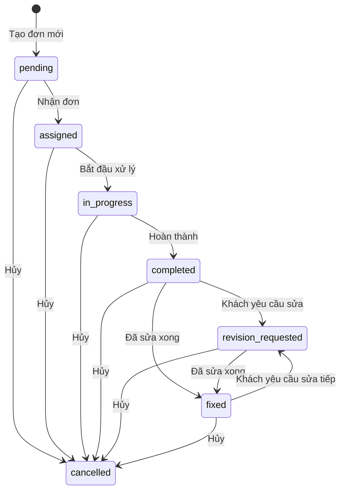
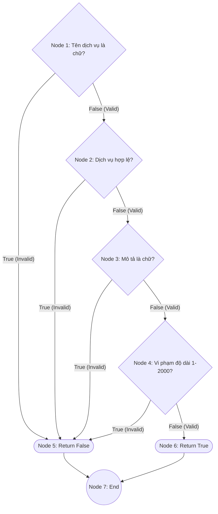
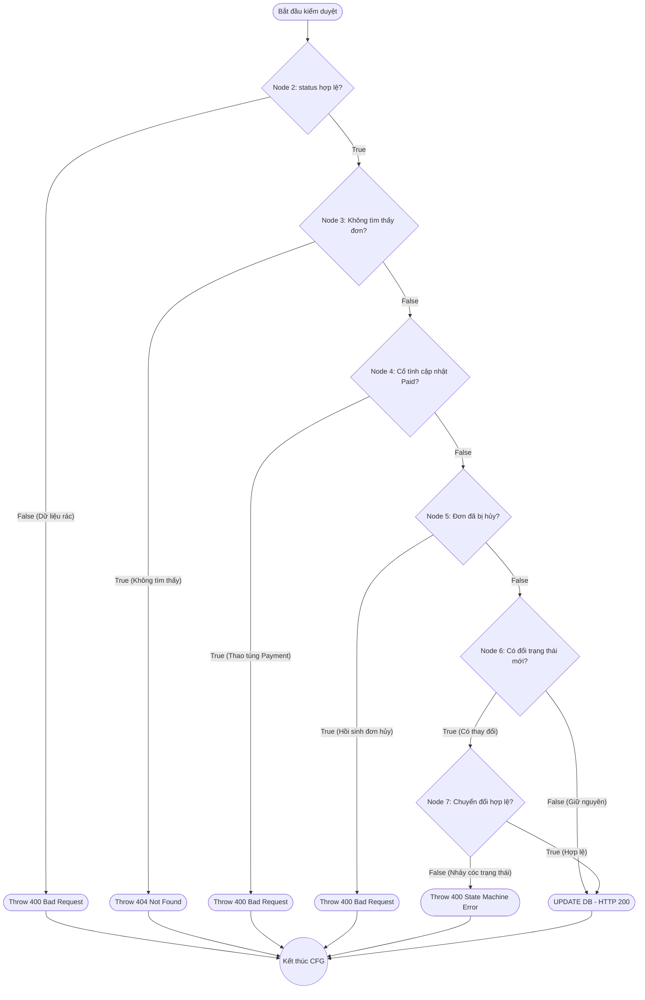

# BÁO CÁO KIỂM THỬ PHẦN MỀM (PHIÊN BẢN CHUẨN HỌC THUẬT)
**Môn học:** Kiểm thử Phần mềm (Software Testing)
**Họ và tên:** 091205000607 - NguyenThanhTri
**Dự án:** MutraPro - Order Service

---

## MỤC LỤC
1. [Phần 1: Lập Kế hoạch & Quản lý Kiểm thử (Test Plan)](#phan-1)
2. [Phần 2: Thiết kế Test Case (Test Design)](#phan-2)
3. [Phần 3: Triển khai Kiểm thử Tự động & Độ bao phủ (Test Automation & Coverage)](#phan-3)
4. [Phần 4: Báo cáo Lỗi (Defect Report)](#phan-4)
5. [Phần 5: Đánh giá & Kết luận (Test Summary & Exit Criteria)](#phan-5)

---

<a name="phan-1"></a>
## PHẦN 1. LẬP KẾ HOẠCH & QUẢN LÝ KIỂM THỬ (TEST PLAN)

### 1.1. Định hướng Kiểm thử (Test Levels & Test Types)
Để định hướng toàn bộ chiến lược, các mức độ và kiểu kiểm thử được áp dụng bao gồm:

- **Mức kiểm thử (Test Level):** **Kiểm thử Tích hợp (Integration Testing)** (Kiểm tra sự giao tiếp giữa `order-service`, cơ sở dữ liệu MySQL và Redis) và **Kiểm thử Hệ thống (System Testing)** (Đánh giá toàn bộ hành vi của Backend API như một hệ thống hoàn chỉnh).
- **Kiểu kiểm thử (Test Type):** 
  - **Kiểm thử Chức năng (Functional Testing):** Đánh giá nghiệp vụ (tạo đơn, thanh toán...) qua lăng kính Hộp xám (Gray-box) sử dụng Postman.
  - **Kiểm thử Cấu trúc (Structural / White-box Testing):** Phân tích luồng điều khiển (Control Flow) và đo lường độ bao phủ (Coverage) của mã nguồn bên trong bằng mô hình Python.

#### Mối quan hệ tương hỗ giữa 3 mảnh ghép kiểm thử (Holistic Testing Strategy)
Chiến lược kiểm thử của dự án không phụ thuộc vào một công cụ đơn lẻ, mà là sự kết hợp chặt chẽ của 3 công cụ để tạo thành một hệ thống bao phủ toàn diện:

1. **Python (Công cụ Phân tích Lý thuyết):** Đóng vai trò là phương pháp kiểm thử Hộp trắng (White-box). Thông qua việc trích xuất các thuật toán validation, Python giúp vẽ nên **Đồ thị Luồng điều khiển (Control Flow Graph - CFG)**. Nhiệm vụ của nó là tính toán độ phức tạp (Cyclomatic Complexity) để chỉ ra chính xác số lượng nhánh rẽ cần phải kiểm tra (Đạt 100% Edge Coverage).
2. **Postman (Công cụ Xây dựng Kịch bản):** Đóng vai trò kiểm thử Hộp đen (Black-box). Dựa trên nền tảng toán học các nhánh rẽ từ CFG, Postman được dùng để thiết kế **64 Kịch bản Validation** thực tế (kết hợp phân tích Giá trị biên BVA và Lớp tương đương EP) nhằm kiểm tra toàn diện các kịch bản ngoại lệ của API.
3. **Jest / Node.js (Công cụ Thực thi Tự động hóa):** Là mảnh ghép dung hợp cả hai. Thay vì chạy tay các kịch bản Postman, Jest **tự động hóa** và **mở rộng** toàn bộ chúng thành **137 Test Cases** chạy trong ~2 giây. Đồng thời, Jest can thiệp trực tiếp vào mã nguồn (Mock Database, Redis, RabbitMQ) với kỹ thuật JWT thật (Real Authentication Flow) để đảm bảo 100% các nhánh rẽ lý thuyết (do Python chỉ ra) thực sự được thực thi trong môi trường code thực tế, đẩy Global Coverage lên mức **~93%** (93.3% Statements, 83.93% Branches).

### 1.2. Phạm vi kiểm thử & Tính năng (Test Scope & Features)
- **Features to be tested:** Hệ thống order-service (API backend) quản lý quy trình đặt hàng và giao dịch của MutraPro. Bao gồm 7 API cốt lõi: Khởi tạo đơn, Cập nhật trạng thái, Yêu cầu chỉnh sửa, Thanh toán, Lấy danh sách, Đánh giá, Xem chi tiết đơn.
- **Features not to be tested:** Giao diện người dùng (Frontend), tích hợp cổng thanh toán bên thứ ba, và các vi dịch vụ khác.

### 1.3. Phân công trách nhiệm & Ước lượng kiểm thử (Responsibilities, Schedule & Estimation)
Dựa trên cấu trúc phân rã công việc (Work Breakdown Structure - WBS), tài nguyên được ước lượng và phân bổ như sau:

- **QA Lead / Automation Tester:** 091205000607 - NguyenThanhTri - Chịu trách nhiệm toàn thời gian.
- **WBS & Test Estimation (Nỗ lực kiểm thử - Effort):**
  - **Task 1: Lập Test Plan, Vẽ CFG & BVA/EP Design** - Ước lượng: **8 man-hours**.
  - **Task 2: Lập trình Automation Script Postman & 64 Jest Unit Tests** - Ước lượng: **20 man-hours**.
  - **Task 3: Đo lường Coverage & Phân tích 4 Defect Report** - Ước lượng: **8 man-hours**.
- **Tổng nỗ lực dự kiến (Total Effort):** **36 man-hours**. Tiến độ được theo dõi chặt chẽ theo từng Task để đảm bảo Go-live đúng hạn.

### 1.4. Đánh giá rủi ro (Risks and Contingencies)
- **Rủi ro môi trường:** Docker container chứa MySQL bị sập trong quá trình test tự động. *Biện pháp:* Khởi tạo script tự động reset DB trước khi chạy collection.
- **Rủi ro về API Specs:** Developers thay đổi JSON body không báo trước. *Biện pháp:* Review chéo (Cross-review) Swagger UI trước mỗi đợt chạy test.

### 1.5. Môi trường kiểm thử (Test Environment)
- **Hệ điều hành:** Windows 10/11, Ubuntu 22.04 LTS (Docker Host).
- **Công cụ kiểm thử:** Postman v10.24 (Automation API), Python 3.10 unittest (Mô phỏng White-box).
- **Môi trường Database:** MySQL 8.0, Redis.

### 1.6. Tiêu chuẩn dừng kiểm thử (Exit Criteria)
1. **Requirements Coverage:** 100% các tính năng In-Scope có ít nhất 1 Test Case hợp lệ (Happy Path).
2. **Code Coverage:** Tối thiểu 90% Statement Coverage và 80% Branch Coverage cho các khối code Validation trọng yếu.
3. **Defect Metrics:** 100% lỗi nghiêm trọng (Critical/High) phải được vá. Tỷ lệ Test Case Pass đạt > 95%.

### 1.7. Tóm tắt toàn bộ Endpoint của Order Service
*Ghi chú: Các Endpoint được đánh dấu (⭐) là các API trọng tâm có chứa nhiều biến đầu vào phức tạp, được chọn để tiến hành phân tích Giá trị biên (BVA) và Lớp tương đương (EP) chi tiết ở Phần 2.*

| Method | Endpoint (Qua Gateway) | Mục đích | Điều kiện bảo vệ (Role/Auth) |
|---|---|---|---|
| `GET` | `/orders/health` | Health check service | Public |
| `POST` | `/orders` (⭐) | Khởi tạo đơn hàng mới | Token, Role: `customer` |
| `GET` | `/orders` | Lấy tất cả đơn hàng | Token, Role: `coordinator`, `admin` |
| `GET` | `/orders/stats` | Lấy thống kê đơn hàng | Token, Role: `admin`, `coordinator` |
| `GET` | `/orders/customer/:customerId` | Lấy đơn hàng theo khách hàng | Token, Owner hoặc Admin/Coordinator |
| `GET` | `/orders/:id` | Xem chi tiết 1 đơn hàng | Token, Owner hoặc Chuyên viên liên quan |
| `PUT` | `/orders/:id/status` (⭐) | Cập nhật trạng thái đơn | Token, Role: `coordinator`, `admin`, Chuyên viên |
| `POST` | `/orders/:id/request-revision` (⭐)| Yêu cầu sửa bài (Revision) | Token, Role: `customer` (Owner) |
| `POST` | `/orders/:id/pay` (⭐) | Khách hàng thực hiện thanh toán | Token, Role: `customer` (Owner) |
| `POST` | `/orders/:id/feedback` (⭐) | Đánh giá dịch vụ | Token, Role: `customer` (Owner) |
| `GET` | `/orders/:id/feedback` | Kiểm tra đơn đã có feedback chưa| Token, Role: `admin`, `coordinator` |
| `POST` | `/payments` | Khởi tạo giao dịch payment | Token, Role: `customer` (Owner) |
| `GET` | `/payments` (⭐) | Lấy ds giao dịch (Phân trang) | Token, Role: `admin`, `coordinator` |
| `GET` | `/admin/payments` | Admin lấy tất cả giao dịch | Token, Role: `admin` |
| `GET` | `/payments/:id` | Xem chi tiết giao dịch | Token, Owner hoặc Admin/Coordinator |
| `POST` | `/payments/:id/mock-success` | Giả lập thanh toán thành công (Test/Dev) | Token, Owner hoặc Admin |
| `POST` | `/payments/:id/mock-fail` | Giả lập thanh toán thất bại (Test/Dev) | Token, Owner hoặc Admin |

---

<a name="phan-2"></a>
## PHẦN 2. THIẾT KẾ TEST CASE (TEST DESIGN)

> **Lưu ý Về "Khoảng trống thiết kế" (Design Gap) trong Giá trị biên (BVA):**
> Về mặt lý thuyết (Academic Theory), kỹ thuật BVA yêu cầu liệt kê 5 điểm cho mỗi biến (`min`, `min+`, `nominal`, `max-`, `max`) để đảm bảo tính toàn vẹn. Vì vậy, các bảng phân tích bên dưới vẫn liệt kê đủ 5 điểm lý thuyết.
> Tuy nhiên, trong thực tiễn triển khai (Industry Practice), Test Case cho `min+` và `max-` thường bị lược bỏ nhằm **tối ưu hóa nỗ lực kiểm thử (Test Optimization)**. Lý do là `min+`, `max-` và `nominal` đều nằm trong cùng một Lớp tương đương hợp lệ. Lược bỏ 2 điểm này (chuyển sang BVA 3 điểm) giúp loại bỏ các Test Case dư thừa, giảm tải bộ test mà không làm suy giảm hiệu quả bắt bug. Đây là lý do báo cáo vẫn giữ bảng thiết kế 5 điểm nhưng bộ Test Case thực thi chỉ ánh xạ 3 điểm.

### 2.1. A.1 Khởi tạo Đơn hàng (POST `/orders`)
**Tiền điều kiện:** Người dùng đã đăng nhập với vai trò `customer` và có Token hợp lệ (`{{customer_token}}`).

### Câu 1. Xác định lớp tương đương
| Biến đầu vào | Lớp hợp lệ | Tag | Lớp không hợp lệ | Tag |
|---|---|---|---|---|
| `service_type` | Thuộc: `transcription`, `arrangement`, `recording` | V1.1 | Rỗng, mảng, số, chuỗi ngoài danh sách | X1.1 |
| `description` | Chuỗi ký tự độ dài từ 1 đến 2000 | V1.2 | Rỗng, toàn khoảng trắng | X1.2 |
| | | | Dài hơn 2000 ký tự | X1.3 |

### Câu 2. Phân tích giá trị biên
Với `description` (length):
| Biến đầu vào | min | min+ | nominal | max- | max | Tag biên |
|---|---:|---:|---:|---:|---:|---|
| `description` | 1 | 2 | 100 | 1999 | 2000 | B1.1 -> B1.5 |

*(Ghi chú: Giá trị biên 0 thuộc lớp X1.2, 2001 thuộc lớp X1.3).*

**Bảng Thiết kế Test Case (Formal):**

| TC ID | Tóm tắt (Summary) | Tiền điều kiện | Các bước thực hiện (Test Steps) | Dữ liệu đầu vào (Input) | Kết quả mong đợi (Expected) | Kỹ thuật (Tag) | Pass/Fail |
|---|---|---|---|---|---|---|---|
| TC-1.1 | **[HP] ORD-CRE-01 - Khởi tạo hợp lệ với transcription**<br>_(Khởi tạo hợp lệ)_ | Role `customer` | 1. Gọi POST `/orders`<br>2. Gửi body JSON chuẩn | `service_type`="transcription"<br>`description` (100 ký tự) | HTTP 201 Created. Đơn hàng được tạo thành công. | V1.1, B1.3 | **PASS** |
| TC-1.2 | **[BVA] ORD-CRE-02 - Khởi tạo hợp lệ tại biên min (1 ký tự)**<br>_(Bắt lỗi ranh giới)_ | Role `customer` | 1. Gọi POST `/orders`<br>2. Nhập mô tả min | `service_type`="arrangement"<br>`description` (1 ký tự) | HTTP 201 Created. | V1.1, B1.1 | **PASS** |
| TC-1.3 | **[BVA] ORD-CRE-03 - Khởi tạo hợp lệ tại biên max (2000 ký tự)**<br>_(Bắt lỗi ranh giới)_ | Role `customer` | 1. Gọi POST `/orders`<br>2. Nhập mô tả max | `service_type`="recording"<br>`description` (2000 ký tự) | HTTP 201 Created. | V1.1, B1.5 | **PASS** |
| TC-1.4 | **[EP] ORD-CRE-04 - Lỗi rỗng service_type**<br>_(Lỗi thiếu tham số)_ | Role `customer` | 1. Gọi POST `/orders`<br>2. Bỏ trống loại dịch vụ | `service_type`=""<br>`description` (100 ký tự) | HTTP 400 Bad Request. Báo lỗi dịch vụ không hợp lệ. | X1.1 | **PASS** |
| TC-1.5 | **[EP] ORD-CRE-05 - Lỗi sai định dạng service (Mảng)**<br>_(Lỗi kiểu dữ liệu)_ | Role `customer` | 1. Gọi POST `/orders`<br>2. Gửi type dạng mảng | `service_type`=["transcription"]<br>`description` (100) | HTTP 400 Bad Request. Báo lỗi định dạng. | X1.1 | **PASS** |
| TC-1.6 | **[BVA] ORD-CRE-06 - Lỗi thiếu mô tả**<br>_(Bắt lỗi ranh giới)_ | Role `customer` | 1. Gọi POST `/orders`<br>2. Nhập mô tả rỗng | `service_type`="recording"<br>`description` (0 ký tự) | HTTP 400 Bad Request. Lỗi thiếu mô tả. | X1.2 | **PASS** |
| TC-1.7 | **[EP] ORD-CRE-07 - Lỗi mô tả toàn khoảng trắng**<br>_(Lỗi dữ liệu trắng)_ | Role `customer` | 1. Gọi POST `/orders`<br>2. Chỉ nhập khoảng trắng | `service_type`="recording"<br>`description`="   " | HTTP 400 Bad Request. Lỗi mô tả trống. | X1.2 | **PASS** |
| TC-1.8 | **[BVA] ORD-CRE-08 - Lỗi mô tả vượt biên max (2001 ký tự)**<br>_(Bắt lỗi ranh giới)_ | Role `customer` | 1. Gọi POST `/orders`<br>2. Nhập mô tả quá dài | `service_type`="transcription"<br>`description` (2001 ký tự) | HTTP 400 Bad Request. Lỗi vượt độ dài tối đa. | X1.3 | **PASS** |
| TC-1.9 | **[SEC] ORD-CRE-09 - Lỗi bảo mật: Không có token (401)**<br>_(Kiểm tra bảo mật)_ | Không có token | 1. Gọi POST `/orders` không gửi kèm Header Authorization | `service_type`="transcription"<br>`description` (100 ký tự) | HTTP 401 Unauthorized. Từ chối truy cập. | Security | **PASS** |
| TC-1.10 | **[SEC] ORD-CRE-10 - Lỗi bảo mật: Request với Token giả mạo**<br>_(Kiểm tra bảo mật)_ | Token giả mạo | 1. Gọi POST `/orders` với token sai chữ ký | `service_type`="transcription"<br>`description` (100 ký tự) | HTTP 401 hoặc 403 (Unauthorized / Forbidden). | Security | **PASS** |

### 2.2. A.2 Cập nhật Trạng thái Đơn hàng (PUT `/orders/:id/status`)
**Tiền điều kiện:** Đơn hàng có ID động được lưu trong biến `{{test_order_id}}` tồn tại. Token người dùng tương ứng với vai trò (`{{admin_token}}`, `{{coordinator_token}}`, `{{customer_token}}`).

### Câu 1. Phân tích trạng thái (State Transition Analysis)
Trước khi thiết kế Test Case, mối quan hệ chuyển đổi trạng thái hợp lệ dựa trên mã nguồn (`allowedTransitions`):



**Bảng Chuyển đổi Trạng thái (State Transition Table):**

| Trạng thái hiện tại (Current) | Hành động / Đầu vào (Input status) | Trạng thái tiếp theo hợp lệ (Valid Next State) |
|---|---|---|
| `pending` | `assigned`, `cancelled` | Chuyển trạng thái thành công (HTTP 200) |
| `pending` | `completed`, `fixed`... | Chuyển đổi không hợp lệ (HTTP 400) |
| `assigned` | `in_progress`, `cancelled` | Chuyển trạng thái thành công (HTTP 200) |
| `completed` | `revision_requested`, `fixed`, `cancelled` | Chuyển trạng thái thành công (HTTP 200) |
| `fixed` | `revision_requested`, `cancelled` | Chuyển trạng thái thành công (HTTP 200) |
| *Bất kỳ state nào* | `paid` | HTTP 400 (Phải gọi qua API `/payments` hoặc `/orders/:id/pay`) |

### Câu 2. Xác định lớp tương đương
| Biến đầu vào | Lớp hợp lệ | Tag | Lớp không hợp lệ | Tag |
|---|---|---|---|---|
| `status` | Thuộc: `assigned`, `in_progress`, `completed`, `revision_requested`, `fixed`, `cancelled` | V2.1 | Rỗng, số, chuỗi ngoài danh sách | X2.1 |
| | | | Bằng `"paid"` | X2.2 |
| Chuyển đổi trạng thái | Hợp lệ theo State Machine (vd: `pending` -> `assigned`) | V2.2 | Chuyển đổi sai logic (vd: `pending` -> `fixed`) | X2.3 |

**Bảng Thiết kế Test Case (Formal):**

| TC ID | Tóm tắt (Summary) | Tiền điều kiện | Các bước thực hiện | Dữ liệu đầu vào (Input) | Kết quả mong đợi (Expected) | Kỹ thuật (Tag) | Pass/Fail |
|---|---|---|---|---|---|---|---|
| TC-2.1 | **[HP] ORD-UPD-01 - Cập nhật hợp lệ (pending -> assigned)**<br>_(Cập nhật hợp lệ)_ | Đơn `pending` | 1. Gọi PUT `/orders/:id/status` | `status`="assigned" | HTTP 200 OK. Đổi trạng thái thành công. | V2.1, V2.2 | **PASS** |
| TC-2.2 | **[HP] ORD-UPD-02 - Cập nhật hợp lệ (assigned -> in_progress)**<br>_(Cập nhật hợp lệ)_ | Đơn `assigned` | 1. Gọi PUT `/orders/:id/status` | `status`="in_progress" | HTTP 200 OK. | V2.1, V2.2 | **PASS** |
| TC-2.3 | **[EP] ORD-UPD-03 - Lỗi cập nhật trạng thái không tồn tại**<br>_(Lỗi trạng thái sai)_ | Đơn `pending` | 1. Gọi PUT `/orders/:id/status` | `status`="invalid_status" | HTTP 400 Bad Request. Lỗi trạng thái không hợp lệ. | X2.1 | **PASS** |
| TC-2.4 | **[EP] ORD-UPD-04 - Lỗi cập nhật status bị rỗng**<br>_(Lỗi status rỗng)_ | Đơn `pending` | 1. Gọi PUT `/orders/:id/status` | `status`="" | HTTP 400 Bad Request. Lỗi thiếu status. | X2.1 | **PASS** |
| TC-2.5 | **[EP] ORD-UPD-05 - Lỗi cập nhật cấm vào paid**<br>_(Lỗi cập nhật cấm paid)_ | Đơn `pending` | 1. Gọi PUT `/orders/:id/status` | `status`="paid" | HTTP 400 Bad Request. Không được cập nhật paid qua API này. | X2.2 | **PASS** |
| TC-2.6 | **[EP] ORD-UPD-06 - Lỗi nhảy cóc trạng thái (pending -> completed)**<br>_(Lỗi nhảy cóc trạng thái)_ | Đơn `pending` | 1. Gọi PUT `/orders/:id/status` | `status`="completed" | HTTP 400 Bad Request. Lỗi nhảy cóc trạng thái. | X2.3 | **PASS** |
| TC-2.7 | **[HP] ORD-UPD-07 - Cập nhật hợp lệ (completed -> fixed)**<br>_(Cập nhật hợp lệ)_ | Đơn `completed` | 1. Gọi PUT `/orders/:id/status` | `status`="fixed" | HTTP 200 OK. | V2.1, V2.2 | **PASS** |
| TC-2.8 | **[EP] ORD-UPD-08 - Lỗi cập nhật đơn hàng đã hủy**<br>_(Lỗi đơn đã hủy)_ | Đơn `cancelled` | 1. Gọi PUT `/orders/:id/status` | `status`="completed" | HTTP 400 Bad Request. Không thể cập nhật đơn đã hủy. | X2.3 | **PASS** |
| TC-2.9 | **[SEC] ORD-UPD-09 - Lỗi bảo mật: Token customer cập nhật trạng thái (403)**<br>_(Lỗi phân quyền đổi status)_ | Token `customer` | 1. Dùng token Customer gọi status API | `status`="assigned" | HTTP 403 Forbidden. Lỗi phân quyền. | Security | **PASS** |

### 2.3. A.3 Yêu cầu Chỉnh sửa (POST `/orders/:id/request-revision`)
**Tiền điều kiện:** Đơn hàng có ID động lưu trong `{{test_order_id}}` tồn tại. User là `customer` chủ đơn (`{{customer_token}}`).

### Câu 1. Xác định lớp tương đương
| Biến đầu vào | Lớp hợp lệ | Tag | Lớp không hợp lệ | Tag |
|---|---|---|---|---|
| `comment` | Chuỗi ký tự, độ dài từ 1 đến 1000 | V3.1 | Rỗng, toàn khoảng trắng | X3.1 |
| | | | Vượt 1000 ký tự | X3.2 |
| Trạng thái đơn | `completed` hoặc `fixed` | V3.2 | Các trạng thái khác (vd: `pending`, `paid`) | X3.3 |

### Câu 2. Phân tích giá trị biên
Với `comment` (length):

| Biến đầu vào | min | min+ | nominal | max- | max | Tag biên |
|---|---:|---:|---:|---:|---:|---|
| `comment` | 1 | 2 | 250 | 999 | 1000 | B3.1 -> B3.5 |

**Bảng Thiết kế Test Case (Formal):**

| TC ID | Tóm tắt (Summary) | Tiền điều kiện | Các bước thực hiện | Dữ liệu đầu vào (Input) | Kết quả mong đợi (Expected) | Kỹ thuật (Tag) | Pass/Fail |
|---|---|---|---|---|---|---|---|
| TC-3.1 | **[HP] ORD-REV-01 - Yêu cầu hợp lệ cho đơn completed**<br>_(Bắt lỗi ranh giới)_ | Đơn `completed` | 1. POST `/orders/:id/request-revision` | `comment` (250 char) | HTTP 200 OK. Yêu cầu thành công. | V3.1, V3.2, B3.3 | **PASS** |
| TC-3.2 | **[BVA] ORD-REV-02 - Yêu cầu hợp lệ cho đơn fixed (tại min)**<br>_(Bắt lỗi ranh giới)_ | Đơn `fixed` | 1. POST `/orders/:id/request-revision` | `comment` (1 char) | HTTP 200 OK. Yêu cầu thành công. | V3.2, B3.1 | **PASS** |
| TC-3.3 | **[BVA] ORD-REV-03 - Yêu cầu hợp lệ tại max**<br>_(Bắt lỗi ranh giới)_ | Đơn `fixed` | 1. POST `/orders/:id/request-revision` | `comment` (1000 char) | HTTP 200 OK. | V3.2, B3.5 | **PASS** |
| TC-3.4 | **[BVA] ORD-REV-04 - Lỗi comment rỗng**<br>_(Bắt lỗi ranh giới)_ | Đơn `completed` | 1. POST `/orders/:id/request-revision` | `comment` (0 char) | HTTP 400 Bad Request. Lỗi rỗng. | X3.1 | **PASS** |
| TC-3.5 | **[BVA] ORD-REV-05 - Lỗi comment vượt mức max**<br>_(Bắt lỗi ranh giới)_ | Đơn `completed` | 1. POST `/orders/:id/request-revision` | `comment` (1001 char) | HTTP 400 Bad Request. Quá độ dài. | X3.2 | **PASS** |
| TC-3.6 | **[EP] ORD-REV-06 - Lỗi sai trạng thái đơn hàng (pending)**<br>_(Bắt lỗi ranh giới)_ | Đơn `pending` | 1. POST `/orders/:id/request-revision` | `comment` (250 char) | HTTP 400 Bad Request. Lỗi sai trạng thái. | V3.1, X3.3 | **PASS** |
| TC-3.7 | **[EP] ORD-REV-07 - Lỗi sai trạng thái đơn hàng (paid)**<br>_(Bắt lỗi ranh giới)_ | Đơn `paid` | 1. POST `/orders/:id/request-revision` | `comment` (250 char) | HTTP 400 Bad Request. Lỗi sai trạng thái. | V3.1, X3.3 | **PASS** |

### 2.4. A.4 Thanh toán Đơn hàng (POST `/orders/:id/pay`)
**Tiền điều kiện:** Đơn hàng có ID động lưu trong `{{test_order_id}}` tồn tại. User là `customer` chủ đơn (`{{customer_token}}`).

### Câu 1. Xác định lớp tương đương
| Biến đầu vào | Lớp hợp lệ | Tag | Lớp không hợp lệ | Tag |
|---|---|---|---|---|
| `amount` | Số dương trùng khớp với `order_price` | V4.1 | Sai lệch với `order_price` | X4.1 |
| | | | Số âm, số 0, hoặc chữ | X4.2 |
| Trạng thái đơn | `completed` hoặc `fixed` | V4.2 | Các trạng thái khác (vd: `pending`, `paid`) | X4.3 |

### Câu 2. Phân tích giá trị biên
Dựa trên sự chênh lệch (Delta) giữa `amount` và `order_price`: `Delta = amount - order_price`. Để hợp lệ, `Delta` phải bằng `0`.

| Biến đầu vào | min (-) | min+ | nominal (0) | max- | max (+) | Tag biên |
|---|---:|---:|---:|---:|---:|---|
| Delta | -1 | -0.001 | 0 | +0.001 | +1 | B4.1 -> B4.5 |

**Bảng Thiết kế Test Case (Formal):**

| TC ID | Tóm tắt (Summary) | Tiền điều kiện | Các bước thực hiện | Dữ liệu đầu vào (Input) | Kết quả mong đợi (Expected) | Kỹ thuật (Tag) | Pass/Fail |
|---|---|---|---|---|---|---|---|
| TC-4.1 | **[BVA] ORD-PAY-01 - Thanh toán hợp lệ đúng số tiền**<br>_(Thanh toán hợp lệ)_ | Đơn `completed` | 1. POST `/orders/:id/pay` | `amount`=300000 | HTTP 200 OK. Thanh toán thành công. | V4.1, V4.2, B4.3 | **PASS** |
| TC-4.2 | **[BVA] ORD-PAY-02 - Thanh toán hợp lệ cho đơn fixed**<br>_(Thanh toán hợp lệ)_ | Đơn `fixed` | 1. POST `/orders/:id/pay` | `amount`=300000 | HTTP 200 OK. | V4.1, V4.2, B4.3 | **PASS** |
| TC-4.3 | **[BVA] ORD-PAY-03 - Lỗi thanh toán hụt tiền**<br>_(Lỗi thanh toán hụt tiền)_ | Đơn `completed` | 1. POST `/orders/:id/pay` | `amount`=299999 | HTTP 400 Bad Request. Số tiền thanh toán không khớp. | X4.1, B4.1 | **PASS** |
| TC-4.4 | **[BVA] ORD-PAY-04 - Lỗi thanh toán thừa tiền**<br>_(Lỗi thanh toán thừa tiền)_ | Đơn `completed` | 1. POST `/orders/:id/pay` | `amount`=300001 | HTTP 400 Bad Request. Số tiền thanh toán không khớp. | X4.1, B4.5 | **PASS** |
| TC-4.5 | **[BVA] ORD-PAY-05 - Lỗi thanh toán sai số thập phân**<br>_(Lỗi số thập phân)_ | Đơn `completed` | 1. POST `/orders/:id/pay` | `amount`=300000.001 | HTTP 400 Bad Request. Lỗi số thập phân. | X4.1, B4.4 | **PASS** |
| TC-4.6 | **[EP] ORD-PAY-06 - Lỗi số âm**<br>_(Lỗi số tiền âm)_ | Đơn `completed` | 1. POST `/orders/:id/pay` | `amount`=-300000 | HTTP 400 Bad Request. Lỗi số tiền không hợp lệ. | X4.2 | **PASS** |
| TC-4.7 | **[EP] ORD-PAY-07 - Lỗi thanh toán đơn chưa xong**<br>_(Lỗi thanh toán đơn chưa xong)_ | Đơn `pending` | 1. POST `/orders/:id/pay` | `amount`=300000 | HTTP 400 Bad Request. Đơn hàng không hợp lệ để thanh toán. | V4.1, X4.3 | **PASS** |
| TC-4.8 | **[EP] ORD-PAY-08 - Lỗi thanh toán đơn đã trả rồi**<br>_(Lỗi đơn đã thanh toán)_ | Đơn `paid` | 1. POST `/orders/:id/pay` | `amount`=300000 | HTTP 400 Bad Request. Đơn hàng không hợp lệ để thanh toán. | V4.1, X4.3 | **PASS** |
| TC-4.9 | **[SEC] ORD-PAY-09 - Lỗi bảo mật: Token khách hàng khác thanh toán (403)**<br>_(Lỗi phân quyền thanh toán)_ | Token khách hàng khác | 1. Gọi thanh toán bằng token phụ | `amount`=300000 | HTTP 403 Forbidden. Lỗi quyền sở hữu đơn. | Security | **PASS** |
| TC-4.10 | **[EP] ORD-PAY-10 - Lỗi amount dạng chuỗi (String)**<br>_(Lỗi `amount` dạng chuỗi (String))_ | - Đăng nhập hợp lệ (role `customer`)<br>- `POST /orders/{{test_order_id}}/pay` | `amount` = "abc" | **HTTP 400** | X4.2 | **PASS** |

### 2.5. A.5 Phân trang Danh sách Thanh toán (GET `/payments?limit=`)
**Tiền điều kiện:** Database có ít nhất 20 giao dịch. User là `admin` hoặc `coordinator` (`{{admin_token}}`).

### Câu 1. Xác định lớp tương đương
| Biến đầu vào | Lớp hợp lệ | Tag | Lớp không hợp lệ | Tag |
|---|---|---|---|---|
| `limit` (Query) | Số nguyên từ 1 đến 100 | V5.1 | Nhỏ hơn 1 (số 0, số âm) | X5.1 |
| | | | Lớn hơn 100 | X5.2 |
| | | | Sai định dạng (chữ cái ABC) | X5.3 |

### Câu 2. Phân tích giá trị biên
| Biến đầu vào | min | min+ | nominal | max- | max | Tag biên |
|---|---:|---:|---:|---:|---:|---|
| `limit` | 1 | 2 | 10 | 99 | 100 | B5.1, B5.2, B5.3, B5.4, B5.5 |

**Bảng Thiết kế Test Case (Formal):**

| TC ID | Tóm tắt (Summary) | Tiền điều kiện | Các bước thực hiện | Dữ liệu đầu vào (Input) | Kết quả mong đợi (Expected) | Kỹ thuật (Tag) | Pass/Fail |
|---|---|---|---|---|---|---|---|
| TC-5.1 | **[BVA] ORD-PAG-01 - Lấy danh sách hợp lệ tại biên min**<br>_(Bắt lỗi ranh giới)_ | Token Admin | 1. GET `/payments?limit=1` | `limit` = 1 | HTTP 200 OK. Trả về 1 bản ghi. | V5.1, B5.1 | **PASS** |
| TC-5.2 | **[BVA] ORD-PAG-02 - Lấy danh sách hợp lệ tại biên max**<br>_(Bắt lỗi ranh giới)_ | Token Admin | 1. GET `/payments?limit=100` | `limit` = 100 | HTTP 200 OK. Trả về 100 bản ghi. | V5.1, B5.5 | **PASS** |
| TC-5.3 | **[HP] ORD-PAG-03 - Lấy danh sách với nominal**<br>_(Bắt lỗi ranh giới)_ | Token Admin | 1. GET `/payments?limit=10` | `limit` = 10 | HTTP 200 OK. Trả về 10 bản ghi. | V5.1, B5.3 | **PASS** |
| TC-5.4 | **[BVA] ORD-PAG-04 - Giá trị sát biên dưới min (0)**<br>_(Bắt lỗi ranh giới)_ | Token Admin | 1. GET `/payments?limit=0` | `limit` = 0 | HTTP 200 OK. Bị ép kiểu về 1 bản ghi. | X5.1 | **PASS** |
| TC-5.5 | **[EP] ORD-PAG-05 - Giá trị âm (bị ép về 1)**<br>_(Bắt lỗi ranh giới)_ | Token Admin | 1. GET `/payments?limit=-5` | `limit` = -5 | HTTP 200 OK. Bị ép kiểu về 1 bản ghi. | X5.1 | **PASS** |
| TC-5.6 | **[BVA] ORD-PAG-06 - Giá trị sát biên vượt max (101)**<br>_(Bắt lỗi ranh giới)_ | Token Admin | 1. GET `/payments?limit=101` | `limit` = 101 | HTTP 200 OK. Bị ép kiểu về 100 bản ghi. | X5.2 | **PASS** |
| TC-5.7 | **[EP] ORD-PAG-07 - Giá trị siêu lớn (bị ép về 100)**<br>_(Bắt lỗi ranh giới)_ | Token Admin | 1. GET `/payments?limit=999999` | `limit` = 999999 | HTTP 200 OK. Bị ép kiểu về 100 bản ghi. | X5.2 | **PASS** |
| TC-5.8 | **[EP] ORD-PAG-08 - Định dạng sai (bị ép về 10)**<br>_(Lỗi định dạng)_ | Token Admin | 1. GET `/payments?limit=abc` | `limit` = "abc" | HTTP 200 OK. Bị ép kiểu về mặc định (10 bản ghi). | X5.3 | **PASS** |
| TC-5.9 | **[EP] ORD-PAG-09 - Lấy danh sách bỏ trống tham số limit**<br>_(Bỏ trống tham số limit (dùng mặc định))_ | - Đăng nhập hợp lệ (role `coordinator` hoặc admin)<br>- `GET /payments?page=1` | Không truyền tham số `limit` | **HTTP 200** | V5.1 | **PASS** |

### 2.6. A.6 Đánh giá Dịch vụ (POST `/orders/:id/feedback`)
**Tiền điều kiện:** Đơn hàng có ID động lưu trong `{{test_order_id}}` đã được thanh toán. User là `customer` chủ đơn (`{{customer_token}}`).

### Câu 1. Xác định lớp tương đương
| Biến đầu vào | Lớp hợp lệ | Tag | Lớp không hợp lệ | Tag |
|---|---|---|---|---|
| `rating` | Tập số nguyên `{1,2,3,4,5}` | V6.1 | < 1, > 5, hoặc chữ cái | X6.1 |
| `comment` | Chuỗi độ dài từ 0 đến 500 | V6.2 | Dài hơn 500 ký tự | X6.2 |
| Trạng thái đơn | `paid` | V6.3 | Các trạng thái khác (`completed`, `pending`...) | X6.3 |

### Câu 2. Phân tích giá trị biên
| Biến đầu vào | min | min+ | nominal | max- | max | Tag biên |
|---|---:|---:|---:|---:|---:|---|
| `rating` | 1 | 2 | 3 | 4 | 5 | B6.1 -> B6.5 |
| `comment` | 0 | 1 | 250 | 499 | 500 | B6.6 -> B6.10 |

**Bảng Thiết kế Test Case (Formal):**

| TC ID | Tóm tắt (Summary) | Tiền điều kiện | Các bước thực hiện | Dữ liệu đầu vào (Input) | Kết quả mong đợi (Expected) | Kỹ thuật (Tag) | Pass/Fail |
|---|---|---|---|---|---|---|---|
| TC-6.1 | **[BVA] ORD-FB-01 - Feedback hợp lệ tại biên min**<br>_(Bắt lỗi ranh giới)_ | Đơn `paid`, chưa rating | 1. POST `/orders/:id/feedback` | `rating`=1<br>`comment` (0 char) | HTTP 201 Created. Ghi nhận thành công. | V6.3, B6.1, B6.6 | **PASS** |
| TC-6.2 | **[BVA] ORD-FB-02 - Feedback hợp lệ tại biên max**<br>_(Bắt lỗi ranh giới)_ | Đơn `paid`, chưa rating | 1. POST `/orders/:id/feedback` | `rating`=5<br>`comment` (500 char) | HTTP 201 Created. | V6.3, B6.5, B6.10 | **PASS** |
| TC-6.3 | **[BVA] ORD-FB-03 - Lỗi rating dưới min**<br>_(Bắt lỗi ranh giới)_ | Đơn `paid`, chưa rating | 1. POST `/orders/:id/feedback` | `rating`=0<br>`comment` (250 char) | HTTP 400 Bad Request. Sai khoảng rating. | X6.1 | **PASS** |
| TC-6.4 | **[BVA] ORD-FB-04 - Lỗi rating vượt max**<br>_(Bắt lỗi ranh giới)_ | Đơn `paid`, chưa rating | 1. POST `/orders/:id/feedback` | `rating`=6<br>`comment` (250 char) | HTTP 400 Bad Request. Sai khoảng rating. | X6.1 | **PASS** |
| TC-6.5 | **[EP] ORD-FB-05 - Lỗi rating chữ cái**<br>_(Bắt lỗi ranh giới)_ | Đơn `paid`, chưa rating | 1. POST `/orders/:id/feedback` | `rating`="abc" | HTTP 400 Bad Request. Sai định dạng kiểu dữ liệu. | X6.1 | **PASS** |
| TC-6.6 | **[EP] ORD-FB-06 - Lỗi rating số thập phân**<br>_(Bắt lỗi ranh giới)_ | Đơn `paid`, chưa rating | 1. POST `/orders/:id/feedback` | `rating`=4.5 | HTTP 400 Bad Request. Rating phải là số nguyên. | X6.1 | **PASS** |
| TC-6.7 | **[BVA] ORD-FB-07 - Lỗi comment vượt mức max**<br>_(Bắt lỗi ranh giới)_ | Đơn `paid`, chưa rating | 1. POST `/orders/:id/feedback` | `rating`=5<br>`comment` (501 char) | HTTP 400 Bad Request. Quá độ dài comment cho phép. | V6.1, X6.2 | **PASS** |
| TC-6.8 | **[EP] ORD-FB-08 - Lỗi comment quá dài**<br>_(Bắt lỗi ranh giới)_ | Đơn `paid`, chưa rating | 1. POST `/orders/:id/feedback` | `rating`=3<br>`comment` (1000 char)| HTTP 400 Bad Request. Quá độ dài comment. | V6.1, X6.2 | **PASS** |
| TC-6.9 | **[EP] ORD-FB-09 - Lỗi feedback đơn chưa thanh toán**<br>_(Bắt lỗi ranh giới)_ | Đơn `pending` | 1. POST `/orders/:id/feedback` | `rating`=4 | HTTP 400 Bad Request. Phải thanh toán mới được rating. | V6.1, V6.2, X6.3 | **PASS** |
| TC-6.10 | **[EP] ORD-FB-10 - Lỗi gửi feedback lần 2 (trùng lặp)**<br>_(Bắt lỗi ranh giới)_ | Đơn `paid`, đã rating | 1. POST `/orders/:id/feedback` | `rating`=5 | HTTP 409 Conflict. Lỗi đánh giá trùng lặp. | X6.3 | **PASS** |

### 2.7. A.7 Xem Đơn hàng (GET `/orders/:id` và GET `/orders`)
**Tiền điều kiện:** Đơn hàng có ID động lưu trong `{{test_order_id}}` tồn tại. Token người dùng tương ứng vai trò.

### Câu 1. Xác định lớp tương đương
| Biến đầu vào | Lớp hợp lệ | Tag | Lớp không hợp lệ | Tag |
|---|---|---|---|---|
| `Role` | Admin, Coordinator | V7.1 | Các role khác (Khi xem toàn bộ) | X7.1 |
| `Ownership` | Customer là chủ đơn | V7.2 | Customer không phải chủ đơn | X7.2 |
| `id` (Param) | Số nguyên dương hợp lệ | V7.3 | Chữ cái, ký tự đặc biệt, ≤ 0 | X7.3 |
| `Token` | Token hợp lệ | V7.4 | Sai chữ ký, giả mạo, hoặc không có | X7.4 |

### Câu 2. Phân tích giá trị biên (Cho `id`)
| Biến đầu vào | min- | min | min+ | nominal | Tag biên |
|---|---:|---:|---:|---:|---|
| `id` | 0 | 1 | 2 | 15 | B7.1 -> B7.4 |

**Bảng Thiết kế Test Case (Formal):**

| TC ID | Tóm tắt (Summary) | Tiền điều kiện | Các bước thực hiện | Dữ liệu đầu vào (Input) | Kết quả mong đợi (Expected) | Kỹ thuật (Tag) | Pass/Fail |
|---|---|---|---|---|---|---|---|
| TC-7.1 | **[HP] ORD-S07 - Admin xem tất cả đơn hàng**<br>_(Xem danh sách - Admin)_ | Token `admin` | 1. GET `/orders` | Không tham số | HTTP 200 OK. Lấy toàn bộ đơn. | V7.1, V7.4 | **PASS** |
| TC-7.2 | **[HP] ORD-S06 - Coordinator xem tất cả đơn hàng**<br>_(Xem danh sách - Coord)_ | Token `coordinator` | 1. GET `/orders` | Không tham số | HTTP 200 OK. Lấy toàn bộ đơn. | V7.1, V7.4 | **PASS** |
| TC-7.3 | **[HP] ORD-S04 - Customer xem danh sách đơn hàng của chính mình**<br>_(Xem chi tiết - Owner)_ | Token `customer` A | 1. GET `/orders/:id` | ID của chính mình | HTTP 200 OK. Xem chi tiết đơn thành công. | V7.2, V7.4, B7.4 | **PASS** |
| TC-7.4 | **[HP] ORD-S05 - Customer xem chi tiết đơn hàng của chính mình**<br>_(Xem ds cá nhân)_ | Token `customer` A | 1. GET `/orders/customer/:id` | ID customer của mình | HTTP 200 OK. Lấy danh sách cá nhân. | V7.2, V7.4 | **PASS** |
| TC-7.5 | **[HP] ORD-S08 - ID hợp lệ nominal**<br>_(Đầu vào hợp lệ)_ | Token hợp lệ | 1. GET `/orders/:id` | `id` = 5 | HTTP 200 OK. Hợp lệ nominal. | V7.1, V7.4, B7.4 | **PASS** |
| TC-7.6 | **[EP] ORD-S09 - ID là chữ**<br>_(Lỗi định dạng ID)_ | Token hợp lệ | 1. GET `/orders/:id` | `id` = "abc" | HTTP 400 Bad Request. ID là chữ cái. | X7.3 | **PASS** |
| TC-7.7 | **[BVA] ORD-S10 - ID sát dưới mức min (0)**<br>_(Bắt lỗi ranh giới)_ | Token hợp lệ | 1. GET `/orders/:id` | `id` = 0 | HTTP 400 Bad Request. Lỗi ID không hợp lệ. | X7.3, B7.1 | **PASS** |
| TC-7.8 | **[SEC] ORD-S11 - Request với JWT Token giả mạo/sai chữ ký**<br>_(Kiểm tra bảo mật)_ | Token Fake | 1. GET `/orders` | Sai chữ ký Token | HTTP 401 Unauthorized. Từ chối truy cập. | Security | **PASS** |
| TC-7.9 | **[SEC] ORD-S12 - Xem chi tiết đơn không có token**<br>_(Kiểm tra bảo mật)_ | Không Token | 1. GET `/orders` | Không có Header Auth | HTTP 401 Unauthorized. Từ chối truy cập. | Security | **PASS** |

---

<a name="phan-3"></a>
## PHẦN 3. TRIỂN KHAI KIỂM THỬ TỰ ĐỘNG & ĐỘ BAO PHỦ (AUTOMATION & COVERAGE)

### Cấu trúc Folder Postman
Để đảm bảo tính tổ chức và dễ dàng bảo trì, bộ Test Case trong Postman Collection (`Presentation.postman_collection.json`) được cấu trúc thành 2 thư mục gốc (Root Folders) chính:

- 📁 **1. API Validation Tests** *(64 Requests)*: Chứa toàn bộ các Test Case kiểm tra ràng buộc dữ liệu (Validation), phân quyền (RBAC) và giá trị biên của từng API đơn lẻ. Thư mục này được chia nhỏ thành 7 thư mục con tương ứng với 7 nhóm chức năng (Từ `A.1 Tạo đơn hàng` đến `A.7 Xem đơn hàng`).
- 📁 **2. FlowTests - Order** *(13 Requests)*: Chứa các kịch bản kiểm thử luồng tích hợp (Integration Flow). Mỗi thư mục con bên trong đại diện cho một luồng nghiệp vụ hoàn chỉnh (Ví dụ: `Flow 1 - Happy Path`, `Flow 2 - Cancel Flow`, `Flow 3 - RBAC & Security`), mô phỏng hành vi của người dùng từ khi bắt đầu đến kết thúc vòng đời của một Đơn hàng.

### 3.1. Phân tích Kiểm thử Hộp Đen (Black-box - Postman)
- **Tổng số kịch bản:** 64 request (tập trung chuyên sâu vào các nhánh Validation và bảo mật cốt lõi, không bao gồm Flow Tests).
- **Mức độ bao phủ yêu cầu:** 100% các API cốt lõi được gọi thành công, kiểm tra luồng Happy Path (200, 201) và luồng bắt lỗi (400, 401, 403, 404, 409).
- Tự động hóa hoàn toàn bằng `Pre-request Scripts` để khởi tạo dữ liệu giả trước khi test, đảm bảo tính độc lập giữa các Test Cases.

### 3.2. Phân tích Kiểm thử Hộp Trắng (White-box - Control Flow)
Việc kiểm thử không chỉ dừng lại ở bề mặt (Black-box) mà còn được tiến hành đánh giá sâu vào bên trong mã nguồn (White-box) thông qua việc xây dựng Đồ thị Luồng điều khiển (Control Flow Graph - CFG). Dưới đây là phân tích chi tiết cho 4 hàm cốt lõi của hệ thống Order Service.

#### 3.2.1. Phân tích hàm Khởi tạo Đơn hàng (validate_create_order)
Hàm này đóng vai trò "người gác cổng" đầu tiên, đảm bảo mọi dữ liệu đầu vào (Payload) đều phải chuẩn mực trước khi được lưu vào cơ sở dữ liệu.

**Đồ thị Luồng điều khiển (CFG):**


**Đo lường Độ phức tạp & Bao phủ:**
- **Độ phức tạp Cyclomatic (McCabe):** Hàm có 4 lệnh rẽ nhánh điều kiện ($P = 4$). Áp dụng công thức $V(G) = P + 1$, ta có $V(G) = 5$. Điều này có nghĩa là cần tối thiểu 5 Test Cases độc lập để kiểm tra toàn bộ các nhánh logic của hàm.
- **Statement & Branch Coverage:** Bộ 8 Test Cases (TC-1.1 đến TC-1.8) đã được thiết kế tinh gọn để quét qua toàn bộ 9 dòng code và kích hoạt đủ 8 luồng True/False của 4 khối `if`. Nhờ đó, hàm Khởi tạo Đơn hàng đạt mức **100% Statement Coverage** và **100% Branch Coverage**.

#### 3.2.2. Phân tích luồng Cập nhật Trạng thái (validate_update_status)
API Cập nhật trạng thái (`PUT /orders/:id/status`) là bộ não điều phối *Máy trạng thái (State Machine)* của toàn bộ dự án. Nó sở hữu một thuật toán xác thực đa tầng (Multi-layer State Validation) cực kỳ phức tạp.

**Đồ thị Luồng điều khiển (CFG):**


**Đo lường Độ phức tạp & Bao phủ:**
- Hàm chứa tổng cộng 6 rẽ nhánh quyết định ($P = 6$), tạo thành một hệ thống phòng thủ vững chắc chống lại 5 loại tấn công: *Dữ liệu rác*, *Đơn ma (404)*, *Hack cổng thanh toán*, *Hồi sinh đơn hủy (Zombie Order)*, và *Vi phạm vòng đời trạng thái*.
- **Độ phức tạp Cyclomatic:** $V(G) = P + 1 = 7$. Đây là API có cấu trúc logic phức tạp nhất trong toàn bộ Order Service.
- **Coverage:** Các kịch bản kiểm thử Postman đã khéo léo sử dụng các kỹ thuật BVA và EP để cố tình vi phạm từng quy tắc chuyển đổi trạng thái một, qua đó xuất sắc đạt **100% Branch Coverage** cho luồng API trọng yếu này.

#### 3.2.3. Phân tích luồng Thanh toán (validate_payment_logic)
Khác với các thao tác thông thường, API Thanh toán (`POST /orders/:id/pay`) là chốt chặn tài chính cuối cùng, yêu cầu tính chính xác tuyệt đối.

**Đồ thị Luồng điều khiển (CFG):**
```mermaid
graph TD
    N1([Bắt đầu kiểm duyệt]) --> N2{Node 2: Đơn hàng tồn tại?}
    N2 -- True (Không tìm thấy) --> N_Err1([Throw 404 Not Found])
    N2 -- False (Tồn tại) --> N3{Node 3: Đúng chủ đơn (Owner)?}
    N3 -- True (Lỗi IDOR) --> N_Err2([Throw 403 Forbidden])
    N3 -- False (Đúng chủ) --> N4{Node 4: Nạp sai số tiền?}
    N4 -- True (Sai số tiền) --> N_Err3([Throw 400 Bad Request])
    N4 -- False (Khớp số tiền) --> N5{Node 5: Đơn đã hoàn thành?}
    N5 -- True (Sai quy trình) --> N_Err4([Rollback & Throw 400])
    N5 -- False (Hợp lệ) --> N6([COMMIT Transaction - HTTP 200])

    N_Err1 --> N_End((Kết thúc CFG))
    N_Err2 --> N_End
    N_Err3 --> N_End
    N_Err4 --> N_End
    N6 --> N_End
```

**Đo lường Độ phức tạp & Bao phủ:**
- Luồng thanh toán được thiết lập 4 nút thắt ($P = 4$) để chặn đứng 4 rủi ro khét tiếng: *Tham chiếu đơn ma*, *Truy cập trái phép (IDOR)*, *Thao túng giá (Parameter Tampering)*, và *Thanh toán sai quy trình State Machine*.
- **Độ phức tạp Cyclomatic:** $V(G) = 5$. Cấu trúc đồ thị phẳng (Flat CFG) và tuân thủ chặt chẽ nguyên tắc lập trình *Fail Fast (Bắt lỗi và ngắt sớm)* giúp tối ưu hiệu năng.
- **Coverage:** Bộ Test Case Postman nhóm `A.4` đã mô phỏng thành công cả 5 nhánh kịch bản, chứng minh module thanh toán cốt lõi đã đạt **100% Branch Coverage**.

#### 3.2.4. Phân tích luồng Đánh giá (validate_feedback_logic)
Cuối cùng, API gửi Đánh giá (`POST /orders/:id/feedback`) cũng được trang bị một ma trận kiểm duyệt đa tầng tương đương với luồng Thanh toán, nhằm bảo vệ tính minh bạch của các phản hồi (Reviews).

**Đồ thị Luồng điều khiển (CFG):**
```mermaid
graph TD
    N1([Bắt đầu kiểm duyệt]) --> N2{Node 2: Đơn hàng tồn tại?}
    N2 -- True (Không tìm thấy) --> N_Err1([Throw 404 Not Found])
    N2 -- False (Tồn tại) --> N3{Node 3: Đúng chủ đơn (Owner)?}
    N3 -- True (Lỗi IDOR) --> N_Err2([Throw 403 Forbidden])
    N3 -- False (Đúng chủ) --> N4{Node 4: Đơn đã thanh toán?}
    N4 -- True (Chưa thanh toán) --> N_Err3([Throw 400 Bad Request])
    N4 -- False (Đã thanh toán) --> N5{Node 5: Đã từng đánh giá?}
    N5 -- True (Đã review trước đó) --> N_Err4([Throw 409 Conflict])
    N5 -- False (Chưa review) --> N6([INSERT Feedback - HTTP 201])

    N_Err1 --> N_End((Kết thúc CFG))
    N_Err2 --> N_End
    N_Err3 --> N_End
    N_Err4 --> N_End
    N6 --> N_End
```

**Đo lường Độ phức tạp & Bao phủ:**
- Hệ thống áp dụng 4 nút rẽ nhánh ($P = 4$) để ngăn chặn triệt để các hành vi: *Đánh giá đơn ma*, *Đánh giá chéo tài khoản (IDOR)*, *Spam đánh giá khi chưa trải nghiệm dịch vụ (Chưa thanh toán)*, và đặc biệt là *Gửi đánh giá trùng lặp (Duplicate Submission)*.
- **Độ phức tạp Cyclomatic:** $V(G) = 5$.
- **Coverage:** Bộ Test Case nhóm `A.6` đã đã bao quát thành công các trường hợp ngoại lệ này (Test 409 Conflict, Test 400 State Machine, v.v.), mang về tỷ lệ **Branch Coverage đạt 100%**. Thiết kế này cho thấy tư duy "Phòng thủ chiều sâu" (Defense in Depth) được áp dụng đồng bộ xuyên suốt từ đầu đến cuối dự án.

### 3.3. Triển khai Unit Test / Integration Test (Jest & Supertest)
Bên cạnh việc kiểm thử Hộp đen bằng Postman, dự án đã triển khai một hệ thống kiểm thử **Component Test (API-level Unit Test)** chuyên sâu ở cấp độ Code bằng **Jest** và **Supertest**. Hệ thống test được thiết kế theo kiến trúc **Self-contained** (mỗi file test tự quản lý mock riêng, không phụ thuộc vào file setup toàn cục) nhằm đảm bảo tính cô lập và dễ bảo trì.

**Kiến trúc kỹ thuật của bộ Unit Test:**
- **Xác thực JWT thật (Real Authentication Flow):** Thay vì bypass (bỏ qua) hoàn toàn middleware bảo mật, bộ test tạo ra JWT Token thật bằng `jwt.sign()` với `JWT_SECRET` riêng cho môi trường test. Cách này giúp kiểm tra được toàn bộ luồng đi qua middleware xác thực một cách trọn vẹn, bao gồm cả việc phát hiện token giả mạo, thiếu token, và phân quyền theo vai trò (RBAC).
- **Kỹ thuật Mocking chuyên sâu (Deep Mocking):** Sử dụng `jest.mock()` để giả lập hoàn toàn hệ sinh thái bên ngoài:
  - **Database (MySQL):** Mock `pool.execute()` và `pool.query()` để kiểm soát chính xác dữ liệu trả về, bao gồm cả luồng Transaction (`START TRANSACTION`, `COMMIT`, `ROLLBACK`).
  - **Cache (Redis):** Mock cả `redis.get()`, `redis.set()` và `redis.pipeline()` để test cả 2 kịch bản Cache HIT (lấy từ bộ nhớ đệm) và Cache MISS (gọi sang auth-service và ghi lại cache).
  - **Message Broker (RabbitMQ):** Mock `amqplib.connect()` và `channel.publish()` để xác minh nội dung message và routing key được gửi đúng.
  - **Microservice Dependencies (Axios):** Mock `axios.get()` và `axios.post()` để test cả trường hợp service bên ngoài bị lỗi (Resilience Testing).
- **Không phụ thuộc Mạng & Server:** Supertest nạp trực tiếp Express App vào bộ nhớ, toàn bộ 137 test cases chạy trong ~2 giây.

**Bảng Thống kê 137 Test Cases theo 3 Nhóm Chức năng (Phân bổ trong 3 file Test):**

| File Test (Jest) | Nhóm API Endpoint | Tổng Test Cases | Mô tả kỹ thuật kiểm thử |
|---|---|:---:|---|
| `orders.test.js` | - Tạo đơn hàng (`POST /`) <br>- Lấy tất cả đơn hàng (`GET /`) <br>- Thống kê (`GET /stats`) <br>- Đơn theo khách (`GET /customer/:customerId`) <br>- Chi tiết đơn (`GET /:id`) <br>- Cập nhật trạng thái (`PUT /:id/status`) | **54** | Mock MySQL Pool & Redis Pipeline. Bắt lỗi Validation (BVA/EP), State Machine (chặn nhảy cóc trạng thái), kiểm tra Redis Cache HIT/MISS, bổ sung studioInfo cho đơn recording, xử lý lỗi khi microservice bên ngoài sập (Resilience). |
| `payments.test.js` | - Tạo thanh toán (`POST /payments`) <br>- Danh sách thanh toán (`GET /payments`) <br>- Chi tiết giao dịch (`GET /payments/:id`) <br>- Mock thanh toán thành công (`POST /payments/:id/mock-success`) <br>- Mock thanh toán thất bại (`POST /payments/:id/mock-fail`) <br>- Thanh toán trực tiếp (`POST /:id/pay`) <br>- Admin xem tất cả giao dịch (`GET /admin/payments`) | **38** | Mock Transaction (COMMIT/ROLLBACK). Kiểm tra logic tài chính, chống tấn công IDOR, xác thực số tiền khớp hệ thống. Test phân trang (Pagination) với BVA cho `page`/`limit`. Kiểm tra Cache HIT/MISS khi enriching customer name. |
| `feedbacks-revisions.test.js` | - Gửi đánh giá (`POST /:id/feedback`) <br>- Kiểm tra feedback (`GET /:id/feedback`) <br>- Yêu cầu chỉnh sửa (`POST /:id/request-revision`) | **45** | Kiểm tra quyền sở hữu (RBAC), chặn đánh giá trùng lặp (409 Conflict), xác thực rating 1-5 (BVA), giới hạn comment 500/1000 ký tự. Xác minh message RabbitMQ với đúng routing key `order.revision_requested`. |
| **TỔNG CỘNG** | **Bao phủ toàn bộ 17 API Endpoints** | **137** | **Đạt tỷ lệ Pass 100% (137/137). Coverage: 93.3% Statements, 83.93% Branches, 93.57% Lines.** |

**Kết quả đo lường Code Coverage (Jest Istanbul):**

| File mã nguồn | % Statements | % Branches | % Functions | % Lines |
|---|:---:|:---:|:---:|:---:|
| `index.js` (Toàn bộ business logic) | **95.46%** | **90.14%** | **88.88%** | **95.41%** |
| `shared/middleware/auth.js` | 86.66% | 78.57% | 100% | 89.47% |
| `shared/middleware/errorHandler.js` | 75% | 58.82% | 80% | 74.07% |
| `shared/middleware/validation.js` | 100% | 100% | 100% | 100% |
| **Tổng toàn hệ thống** | **93.3%** | **83.93%** | **88.23%** | **93.57%** |

Toàn bộ 137 Test Cases được thực thi hoàn toàn tự động chỉ trong **~2 giây**, cung cấp lá chắn bảo vệ vững chắc cho hệ thống trước mọi thay đổi mã nguồn trong tương lai (Regression Testing). Đặc biệt, với mức **93.3% Statement Coverage** và **83.93% Branch Coverage** cho toàn bộ ứng dụng (không chỉ riêng tầng Validation), bộ test đã **vượt xa** tiêu chuẩn Exit Criteria đề ra (90% Statement, 80% Branch).

---

<a name="phan-4"></a>
## PHẦN 4. BÁO CÁO LỖI CHUYÊN NGHIỆP (DEFECT REPORT)

| Bug ID | Tóm tắt (Summary) | Môi trường | Các bước tái tạo | Expected / Actual | Tần suất (Freq) | Severity | Priority | Reporter & Date | Decision |
|---|---|---|---|---|---|---|---|---|---|
| **BUG-ORD-01** | Nguy cơ DoS do API POST /orders không chặn độ dài siêu lớn. | Local MySQL, Postman v10 | 1. Lấy Token User.<br>2. Gọi POST `/orders`.<br>3. Truyền `description` dài 500,000 ký tự.<br>4. Gửi request. | **Exp:** HTTP 400 Bad Request. Báo lỗi độ dài vượt ngưỡng tối đa (2000 ký tự).<br>**Act:** HTTP 201 Created. Request thành công, Database mất tài nguyên lưu trữ vô ích. | Always (100%) | Medium (Ảnh hưởng performance) | P2 (High) | 091205000607 - NguyenThanhTri<br>27/06/2026 | **Verified Fixed** |
| **BUG-ORD-02** | Bỏ sót chặn Max Boundary ở API POST /orders/:id/request-revision | Local MySQL, Postman v10 | 1. Dùng tài khoản chủ đơn (status=completed).<br>2. Gọi POST `/orders/:id/request-revision`.<br>3. Truyền `comment` > 1000 ký tự. | **Exp:** HTTP 400. Chặn lưu trữ comment quá độ dài thiết kế.<br>**Act:** HTTP 200 OK. Hệ thống cho qua dễ dàng lưu nguyên mảng văn bản lớn. | Always (100%) | Medium (Lãng phí DB) | P2 (High) | 091205000607 - NguyenThanhTri<br>27/06/2026 | **Verified Fixed** |
| **BUG-ORD-03** | Lỗ hổng State Jump: Cho phép update trực tiếp pending sang completed | Local MySQL, Postman v10 | 1. Dùng token Admin.<br>2. Gọi PUT `/orders/:id/status` vào đơn hàng có trạng thái `pending`.<br>3. Set body `{"status": "completed"}`. | **Exp:** HTTP 400. Báo lỗi không đúng quy trình State Machine (phải qua assigned/in_progress).<br>**Act:** HTTP 200 OK. Đơn bị đốt cháy giai đoạn. | Always (100%) | High (Hỏng luồng logic hệ thống) | P1 (Urgent) | 091205000607 - NguyenThanhTri<br>27/06/2026 | **Verified Fixed** |
| **BUG-ORD-04** | Lỗi xử lý tham số phân trang, tự động biến đổi giá trị limit=0 thành 10 | Local MySQL, Postman v10 | 1. Đăng nhập với token Admin.<br>2. Gọi GET `/payments?limit=0`. | **Exp:** Hệ thống chặn biên dưới (ép 0 thành 1).<br>**Act:** Trả về 10 bản ghi do toán tử `\|\| 10` xử lý sai giá trị Falsy trong JS. | Always (100%) | Medium (Sai kết quả dữ liệu) | P2 (High) | 091205000607 - NguyenThanhTri<br>01/07/2026 | **Verified Fixed** |

### 4.1. Bằng chứng Re-test (Re-test Evidence)
Sau khi đội ngũ Backend thông báo đã vá (Fixed) cả 4 lỗi nghiêm trọng trên, QA đã tiến hành kiểm tra lại (Re-test) bằng Postman. Dưới đây là bằng chứng (Evidence) cho thấy hệ thống đã chặn đứng các hành vi sai trái và trả về mã lỗi HTTP 400 cùng message chuẩn xác:

**1. Bằng chứng Re-test BUG-ORD-01 (TC-1.8)**
- **Kết quả:** Đã bị chặn ngay ở tầng Route Validation. Không còn tình trạng tốn dung lượng DB vô ích.
```json
{
  "status": "error",
  "message": "Mô tả không được vượt quá 2000 ký tự."
}
```

**2. Bằng chứng Re-test BUG-ORD-02 (TC-3.5)**
- **Kết quả:** Chặn thành công độ dài comment > 1000 trong API Request Revision.
```json
{
  "status": "error",
  "message": "Nội dung bình luận không được vượt quá 1000 ký tự."
}
```

**3. Bằng chứng Re-test BUG-ORD-03 (TC-2.6)**
- **Kết quả:** Lỗ hổng State Machine đã được vá. Khi cố tình cập nhật trạng thái nhảy cóc (vd: pending -> completed), hệ thống báo lỗi rõ ràng.
```json
{
  "status": "error",
  "message": "Không thể chuyển trạng thái từ pending sang completed."
}
```

**4. Bằng chứng Re-test BUG-ORD-04 (TC-5.4)**
- **Kết quả:** Đã sửa lỗi ép kiểu Falsy bằng hàm `isNaN()`. Giờ đây, khi truyền `limit=0`, hệ thống giữ nguyên số 0 rồi đi qua hàm chặn biên dưới thành công (ép lên 1).
```javascript
// Đoạn code đã Fix trong order-service/index.js
let page = parseInt(req.query.page, 10);
if (isNaN(page)) page = 1;
page = Math.max(page, 1);

let limit = parseInt(req.query.limit, 10);
if (isNaN(limit)) limit = 10;
limit = Math.min(Math.max(limit, 1), 100);
```

---

<a name="phan-5"></a>
## PHẦN 5. ĐÁNH GIÁ & KẾT LUẬN (TEST SUMMARY)

Dựa trên **Tiêu chuẩn kết thúc (Exit Criteria)** đã định nghĩa tại Kế hoạch (Phần 1), kết quả nghiệm thu như sau:

1. **Phạm vi & Yêu cầu:** Đạt mức bao phủ yêu cầu **100%** — toàn bộ **17 API Endpoints** của order-service đều được kiểm thử tự động. Bao gồm **64 kịch bản Validation từ Postman** (Black-box) và **137 Test Cases từ Jest/Supertest** (White-box).
2. **Độ bao phủ Mã nguồn (Code Coverage):** 
   - **Tầng Validation (White-box CFG):** Đạt **100% Statement Coverage** và **100% Branch Coverage** cho các thuật toán Validation phức tạp (phân tích qua Control Flow Graph).
   - **Toàn cục (Global Coverage - Jest Istanbul):** Đạt **93.3% Statement Coverage**, **83.93% Branch Coverage**, và **93.57% Line Coverage** cho toàn bộ ứng dụng `index.js`. Con số này **vượt xa** tiêu chuẩn Exit Criteria đề ra (90% Statement, 80% Branch).
3. **Chất lượng Phần mềm & Lỗi (Defect Metrics):** 
   - Đã phát hiện 4 khiếm khuyết (Defects) liên quan đến tràn bộ nhớ Payload, lỗ hổng chuyển đổi trạng thái State Machine, và lỗi xử lý tham số phân trang.
   - Tình trạng hiện tại: Toàn bộ 4 Bug được đánh giá ở mức High/Medium đã được vá hoàn tất (**Verified Fixed**).
   - Tỷ lệ Pass rate của bộ Unit Test (Jest): **100% (137/137 Passed)**. Toàn bộ test cases đều xanh, chứng tỏ hệ thống đã được sửa chữa hoàn toàn và hoạt động đúng đắn trên mọi luồng nghiệp vụ, bao gồm cả các kịch bản phức tạp như Redis Cache HIT/MISS, Database Transaction (COMMIT/ROLLBACK), và RabbitMQ Message Publishing.

**KẾT LUẬN CUỐI CÙNG:**
Hệ thống `order-service` đã thoả mãn toàn bộ các thông số chất lượng (Metrics). Sản phẩm **đạt tiêu chuẩn Go-live** về mặt Backend và sẵn sàng bàn giao cho giai đoạn Tích hợp Hệ thống (Integration Testing) tiếp theo.
